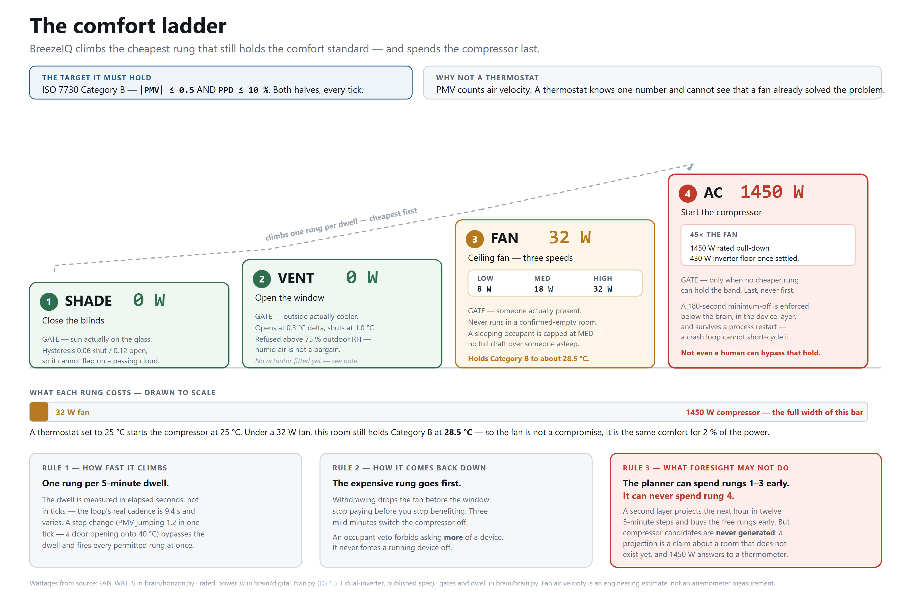
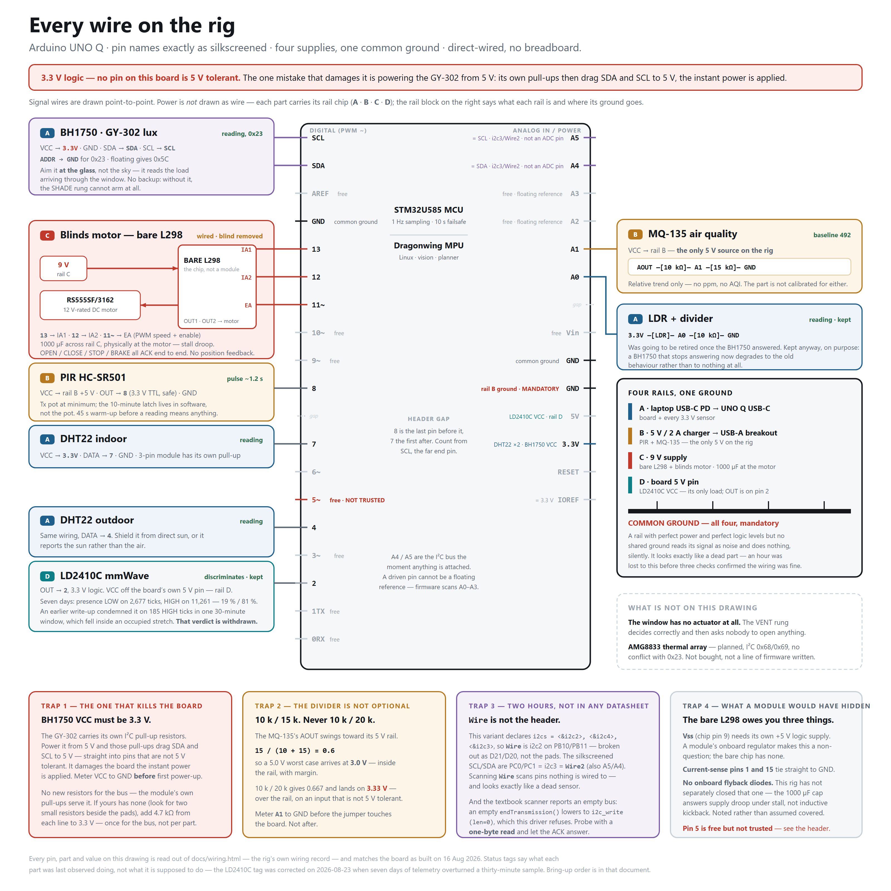
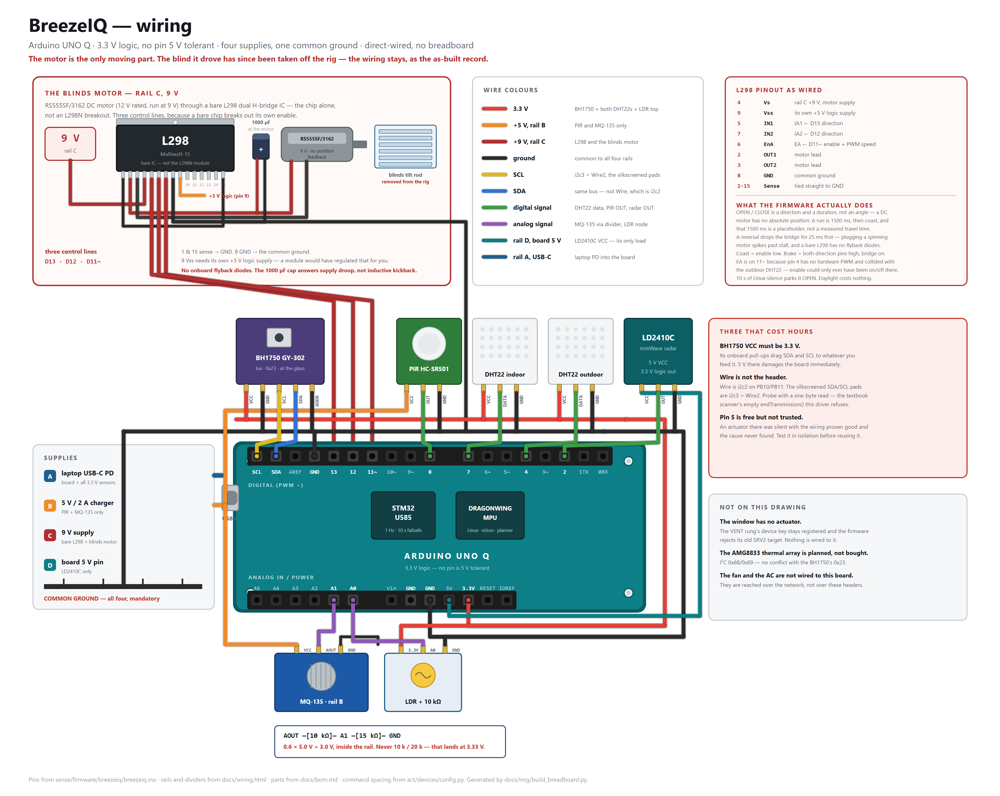

# BreezeIQ

**A room-comfort controller that runs entirely on one Arduino UNO Q.** It does not
hold a thermostat setpoint. It computes how the room *feels* — ISO 7730 PMV, which
counts air velocity, so it knows a fan makes 28 °C feel like 25 °C — and then buys
that feeling with the cheapest watt available.



A thermostat set to 25 °C starts a 1450 W compressor at 25 °C. Under a 32 W ceiling
fan the same room still holds ISO Category B comfort at **28.5 °C**. The fan is not a
compromise, it is the same comfort for 2 % of the power — and a setpoint cannot see
that, because air velocity is not one of its inputs.

Each rung fires only if its own gate passes: sun actually on the glass, outdoor air
actually cooler, an occupant actually present. The compressor is spent last, and a
projection is never allowed to start it.

---

## How it works

- **Both halves of the board do real work.** The STM32U585 samples every sensor at
  1 Hz, drives the blinds motor and the LED matrix, and holds a failsafe. The Linux
  MPU runs camera inference, the comfort maths, the policy, SQLite and the web
  console. They talk over Arduino RouterBridge RPC.
- **The STM32 can save the room without Linux.** Ten seconds with no Bridge call and
  the MCU parks the room itself — blinds driven open, failsafe glyph on the matrix —
  armed from boot, re-armed on the next call. A planner that has wedged cannot
  notice it has wedged.
- **One file decides.** `brain/brain.py` is a pure function: reading in, plan out. No
  sockets, no files, no clock. Everything else is transport, so any surprise has
  exactly one suspect.
- **Occupancy is counted on-device and kept nowhere.** A YOLO11s model runs on the
  board's own CPU through ONNX Runtime, fused with the PIR. Frames are counted and
  discarded; one integer is logged. No image ever leaves the board or is stored.
- **An hour-ahead planner spends the free rungs early** — shade and ventilate before
  the heat arrives — but is forbidden from ever starting the compressor, because a
  projection is a claim about a room that does not exist yet.

The board serves its own console over Wi-Fi at `http://breeze.local:8000` — the room
view, a workbench with every raw sensor value, and a log of every command it has
sent and why.

---

## What you need

**₹3 779 (about $45)** of parts if you already own a USB-C hub with power
passthrough, **₹4 629 (about $55)** if you need one too. The board itself came as a
contest award. Prices are Indian street estimates, August 2026.

| Part | Qty | ₹ | What it does |
|---|--:|--:|---|
| **Arduino UNO Q** (4 GB) | 1 | — | Both brains: STM32U585 MCU + Qualcomm Dragonwing Linux MPU |
| **DHT22 / AM2302** | 2 | 250 | Indoor temperature and humidity → the comfort solve. Outdoor → the VENT gate |
| **BH1750** GY-302 lux | 1 | 129 | Sun on the glass → the SHADE gate. I²C, **3.3 V only** |
| **LDR** (GL5528) + 10 kΩ | 1 | 20 | Fallback light sense when lux is unavailable |
| **HC-SR501** PIR | 1 | 90 | Motion → wakes the camera. 3.3 V TTL output, safe |
| **MQ-135** + 10 kΩ/15 kΩ | 1 | 150 | Air-quality trend → evidence for the VENT rung |
| **HLK-LD2410C-P** mmWave radar | 1 | 429 | Presence for a person sitting still. 5 V VCC, 3.3 V logic |
| **UVC webcam**, 720p | 1 | 700 | On-device person count. Must be UVC-class |
| **RS555SF/3162** DC motor | 1 | 50 | Tilts the blinds. 12 V rated, run at 9 V |
| **Bare L298** dual H-bridge IC | 1 | 110 | Drives that motor. *Not* the L298N module — see the traps |
| Motor coupler / bracket | 1 | 40 | Joins the motor to the blind's tilt rod |
| USB-A female breakout | 1 | 60 | Splits the 5 V sensor rail off a spare charger |
| 1000 µF cap + resistor kit | 1 | 50 | Bulk capacitance at the motor, and the two dividers |
| Breadboard 830-pt + jumpers | 1 | 350 | The rig itself |
| 5 mm LED assortment | 1 | 30 | Bench indicators while wiring the driver |
| 9 V supply | 1 | — | Rail C, the motor only |
| USB-C hub **with PD passthrough** | 1 | 850 | The board is USB-C only; this is how the webcam and power coexist |
| White cup + standoff | 1 | 0 | **Radiation shield for the outdoor DHT22 — not optional** |
| Cardboard box + cardstock | 1 | 0 | Scale-model blinds |

Plus, on the network rather than on the board: a **smart ceiling fan** (Atomberg), a
**smart plug** for the AC, and a **smart light**. Any device Home Assistant can reach
works — adding a brand is one file in `act/devices/`.

⚠️ **The USB-C hub must have true PD passthrough.** Without it the board runs off the
hub's own budget and browns out under motor load, dropping the RPC bridge. This is the
one substitution that fails silently.

⚠️ **The radiation shield is not optional.** A DHT22 in direct sun reads 5–10 °C above
true air temperature, which holds the VENT gate false all day and silently disables
free cooling.

---

## Wiring

Arduino UNO Q, **3.3 V logic — no pin on this board is 5 V tolerant.** Pin names are
exactly as silkscreened (no `D` prefix, `~` kept). Direct-wired, no breadboard needed.



### Every connection

| Part | UNO Q pin | Wiring | Rail |
|---|---|---|---|
| DHT22 indoor | `7` | VCC → `3.3V` · DATA → `7` · GND | A |
| DHT22 outdoor | `4` | VCC → `3.3V` · DATA → `4` · GND. Shield it from the sun | A |
| BH1750 GY-302 | `SDA` `SCL` | VCC → `3.3V` · SDA → `SDA` · SCL → `SCL` · **ADDR → GND** for address `0x23` · GND | A |
| LDR + 10 kΩ | `A0` | `3.3V` —[LDR]— `A0` —[10 kΩ]— GND | A |
| PIR HC-SR501 | `8` | VCC → rail B +5 V · OUT → `8` · GND | B |
| MQ-135 | `A1` | VCC → rail B +5 V · AOUT —[10 kΩ]— `A1` —[15 kΩ]— GND | B |
| LD2410C radar | `2` | VCC → the board's own `5V` pin · OUT → `2` · GND | D |
| Blinds motor, via bare L298 | `13` `12` `11~` | IA1 ← `13` · IA2 ← `12` · EA ← `11~` (PWM speed + enable) · L298 Vs ← 9 V · L298 Vss ← +5 V · sense pins 1 and 15 → GND · motor leads ← OUT1/OUT2 · 1000 µF across rail C at the motor | C |

The fan, the AC and the light are **not** wired to the board. They are reached over
the network. The window has no actuator — the VENT rung decides and asks nobody.

### Four rails, one ground

| Rail | Source | Feeds |
|---|---|---|
| **A** | Laptop or charger USB-C PD → the board's USB-C | The board and every 3.3 V sensor, off its own regulator |
| **B** | 5 V / 2 A charger → USB-A breakout | PIR, MQ-135, and the L298's Vss logic pin. The only 5 V on the rig |
| **C** | 9 V supply | L298 Vs, the blinds motor, the 1000 µF cap |
| **D** | The board's own 5 V pin | The radar only |

**Every rail's ground must land on a board GND pin.** A rail with perfect power and no
shared ground reads its signal as noise and does nothing, silently. It looks exactly
like a dead part — an hour was lost to this before three checks confirmed the wiring
was fine.

### Four traps, all measured on this hardware

1. **BH1750 VCC must be 3.3 V.** The GY-302 carries its own I²C pull-ups, and they sit
   on whatever VCC you feed it. Feed it 5 V and it drags SDA and SCL to 5 V, into pins
   that are not 5 V tolerant, the instant power is applied. Meter VCC to GND *before*
   first power-up.
2. **The MQ-135 divider is not optional, and 10 k / 20 k is wrong.** Its AOUT swings
   toward its 5 V rail. 10 k / 15 k gives 0.6, so a 5.0 V worst case arrives at `A1` as
   3.0 V, inside the rail with margin. 10 k / 20 k gives 0.667 and lands on 3.33 V.
3. **`Wire` is not the header.** On this board the silkscreened SDA/SCL pads are
   PC0/PC1 = i2c3 = **`Wire2`** in firmware. `Wire` is i2c2 on PB10/PB11, broken out as
   D21/D20 — scanning it scans pins nothing is wired to, and looks exactly like a dead
   sensor. Probe with a one-byte read, not an empty `endTransmission()`.
4. **A bare L298 owes you three things** an L298N module would have handled quietly:
   pin 9 `Vss` needs its own +5 V logic supply, current-sense pins 1 and 15 tie
   straight to GND, and there are **no onboard flyback diodes**. The 1000 µF cap
   answers supply droop under stall current; it is not a flyback diode.

### The same rig, drawn for reading



`docs/breezeiq.fzz` is the same circuit as a **Fritzing** sketch — 15 custom parts,
40 wires, self-contained, no core-parts dependency. Open it once in Fritzing and
re-save before relying on it; it was generated rather than drawn by hand.

### Bring-up order

Sensors first, motor last — brownouts show up there first. Power everything off for
each change. Bring up one sensor at a time and confirm it reads before adding the
next. Wire the motor unloaded, confirm OPEN/CLOSE/STOP, and only then couple it to
the tilt rod.

---

## Build it

### 1 · Try it with no hardware at all

```bash
git clone https://github.com/kowshiksiva5/breezeiq-uno-q.git
cd breezeiq-uno-q
./tools/run.sh setup          # venv + three dependencies
./tools/run.sh demo           # 10 ticks against a simulated room
```

That runs the real control loop — the real comfort solve, the real ladder, the real
telemetry — against a simulated room, and commands nothing. Then:

```bash
./tools/run.sh console        # the web console on http://127.0.0.1:8000
```

### 2 · Flash the STM32 side

```bash
cd firmware
arduino-cli compile --clean --libraries ./libraries -b arduino:zephyr:unoq breezeiq
arduino-cli upload -b arduino:zephyr:unoq -p /dev/cu.usbmodem<yours> breezeiq
```

**Always `--clean`.** Uploads have reported success without flashing on this board;
every sketch prints `BUILD=n` on boot, so check that it says what you just flashed.

### 3 · Put the board on Wi-Fi, then deploy

```bash
./tools/run.sh wifi <your-ssid>     # over USB; the password is asked for, never stored
./tools/run.sh deploy               # pushes the app to the board over SSH
```

`deploy.sh` assembles the App Lab app — the sketch, the Python, the manifest —
stages it on the board, import-checks it there, and only then swaps it in. Press
**Run** in App Lab, or let the boot hook start it after a power cut. The console is
then at `http://breeze.local:8000` from any phone on the same Wi-Fi.

⚠️ **The UNO Q has one USB controller.** A USB-C *data* cable puts the board in
peripheral mode — that is what serves `adb`, and it is also what holds the USB power
regulator disabled, so no USB camera can enumerate. ADB and the camera are mutually
exclusive. Use the cable for first bring-up, then work over Wi-Fi.

### 4 · Connect the real devices

```bash
cp .env.example .env && chmod 600 .env      # then fill it in
```

Home Assistant runs on the board as a protocol adapter and holds no automations of
its own — `act/infra/docker-compose.yml` is the container that runs here. It speaks
Tuya so BreezeIQ never has to. The Atomberg fan is reached through its own API, with
state read free off LAN beacons to stay under the vendor's 100-calls-per-day limit.

**Nothing switches anything real until two gates are set**, both in `.env`:
`BREEZEIQ_LIVE=1` and `BREEZEIQ_SAFETY_VALIDATED=1`. Dry-run is the default on
purpose — a fresh clone must not be able to turn someone's AC on. Set the second gate
only after dry-run output, entity mapping, independent readback, rate limits and the
compressor's minimum-off hold have all been checked.

```bash
./tools/run.sh control --dry-run    # decide against live sensors, touch nothing
./tools/run.sh devices health       # what the device layer can see
./tools/run.sh control --live       # command real devices
```

---

## What is in here

| Path | What |
|---|---|
| `firmware/breezeiq/breezeiq.ino` | The MCU sketch: 1 Hz sampling, Bridge RPC, motor grammar, the 10 s failsafe |
| `firmware/libraries/BreezeIQ/` | One small module per sensor, shared by the sketch |
| `brain/brain.py` | **The only thing that decides anything.** The ladder, as a pure function |
| `brain/comfort.py` | ISO 7730 PMV and PPD |
| `brain/horizon.py` | The hour-ahead planner |
| `brain/digital_twin.py` | The AC response model |
| `brain/loop.py` | Read → decide → command → log. Translates; decides nothing |
| `brain/telemetry.py` | Every tick to SQLite |
| `brain/dashboard.py` · `console.py` | The API, and the pages rendered over it. Stdlib only |
| `sense/reader/` | Bridge RPC, serial and simulated sensor sources behind one interface |
| `sense/vision/` | On-device person counting, and the policy for when to look |
| `act/devices/` | Home Assistant, Atomberg, the board's own motor, simulated |
| `app/` | App Lab packaging |
| `tools/` | `run.sh` for everything local, `deploy.sh` for the board |
| `docs/` | The wiring drawings and the Fritzing sketch |

Adding a device brand is one file: subclass `DeviceBackend`, register it, done.
Nothing upstream changes — the Atomberg fan proved it, and the ladder never learned a
word of its protocol.

---

## Known limits, stated plainly

- **The window has no actuator.** The VENT rung decides correctly and then asks
  nobody to open anything. Three of the four rungs move real hardware.
- **The "weather" is the board's own outdoor sensor**, not a fetched forecast. That
  is deliberate — the appliance has to work with no internet — but it means the
  horizon is a projection from local physics, not a meteorological one.
- **The energy comparisons are simulated**, from the repository's own room model,
  and are labelled that way wherever they appear.
- **The console trusts its LAN.** There is no login. Keep the board behind your
  router and do not expose port 8000 to the internet.

---

## License

MIT — see [`LICENSE`](LICENSE). Built on an Arduino UNO Q supplied as a contest award
for *Invent the Future with Arduino UNO Q & App Lab* (Hackster.io).
